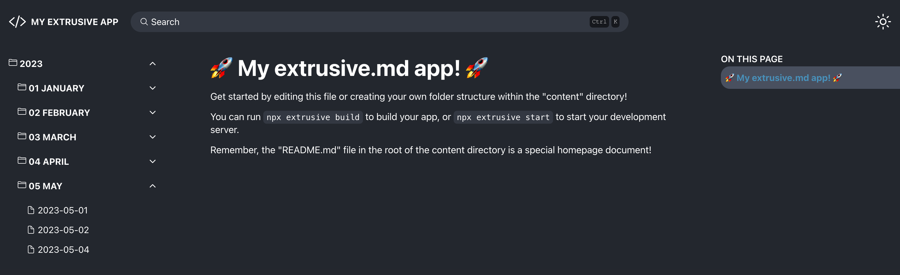

# extrusive.md

[Obsidian](https://obsidian.md/) is an **"extrusive”** rock, which means it is made from magma that erupted out of a volcano.
 
^ Wonderful markdown editor!

---

#### `extrusive.md` is now stable! Install version `^1.2.3` today!

There are a lot of markdown interfaces out there. There are a lot of documentation tools out there.

`extrusive.md` fills the niche that none of these do.

1. **100% free and open-source** now, and forever!
2. Hands you control and can be compiled as a **static website**, or an **express server**!
3. Designed with a **simple interface** that requires almost no set-up work.
4. Allows easy implementation of **custom styles** in your documentation.
5. **Builds lightning-fast** using your folder structure and `.md` files. Meaning you can edit your docs in whatever environment you want.
6. Includes a **built-in search bar**, that works... That you don't have to pay for!
7. Has a simple toggle for **light/dark mode**.
8. Built with a **mobile-first design** model and styled with **inspiration from other modern documentation websites**.
9. O.O.T.B. support for **[ion-icons](https://ionic.io/ionicons) + custom HTML** directly in your markdown!
10. Built-in print/save as pdf support.

`extrusive.md` may not have all the bells and whistles, but it makes up for these by being open-ended and ready for you to customize!

## Installation

[Read the docs!](https://nottimtam.github.io/extrusive-docs/)

## Development Roadmap

Client:

-   Emoji support. (`[marked-emoji](https://www.npmjs.com/package/marked-emoji)`)
-   Admonition support. (`[marked-admonition-extension](https://www.npmjs.com/package/marked-admonition-extension)`)
-   Cleaner, more reliable client-side code.
-   Automatical removal of search results that link to paths that no longer exist.
-   Folder/file level of importance for sorting.
-   Search should use all unique words in query and compare against all unique words in document.

CLI:

-   **"start"** command with live server for development that does not rely on a build.
-   Sanitize output html.
-   Fix build command only sometimes needing the `--force` option to overwrite. (usually when not using the default "build" folder label)

General:

-   Explore the potential for headless CMS.
